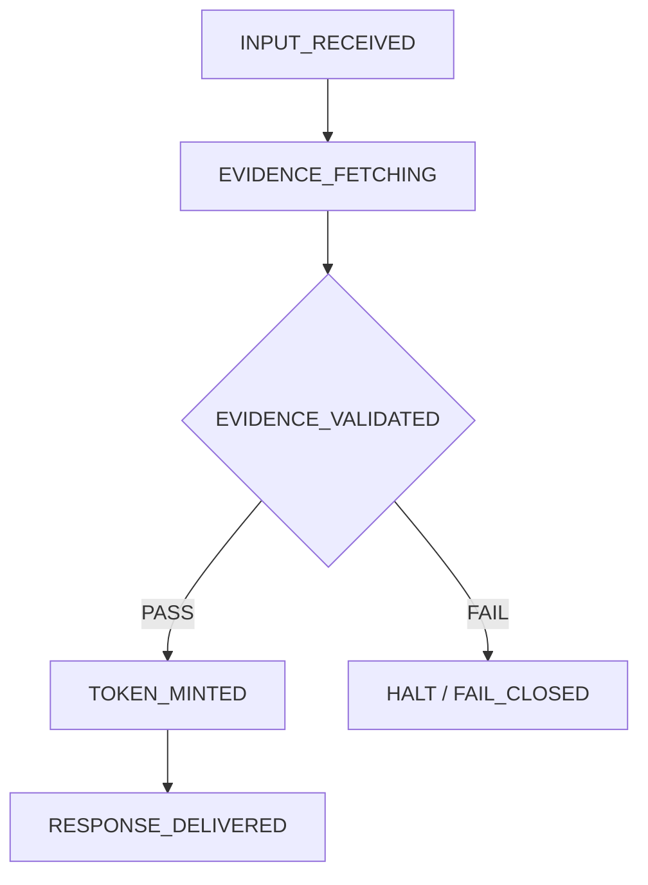

# Lawmadi OS — Architecture Reference (Public / Sanitized)

<p align="left">
  <!-- DOI -->
  <a href="https://doi.org/10.5281/zenodo.18525310">
    
  </a>
  <!-- Status / License -->
  
  
</p>

**Document Version:** 3.0 *(Public/Sanitized)*
**Repository Release:** v2.0.0
**Date:** 2026-02-09

> **“Convert Anxiety into Actionable Logic.”**
> **“불안을 실행 가능한 논리로 전환하다.”**

---

## Quick Links

<p align="left">
  <a href="./llms.txt">
    
  </a>
  <a href="./LICENSE.txt">
    
  </a>
  <a href="./CITATION.cff">
    
  </a>
</p>

---

## TL;DR

This document provides a **public, sanitized architectural overview** of **Lawmadi OS** — a **deterministic**, **FSM-based** Legal Decision Operating System (LDOS).

* ✅ Public reference (sanitized): **scoring formulas, routing weights, deployment configs, and operational secrets are excluded**
* 🚫 Not a chatbot / search engine / legal DB
* ✅ Generates **reproducible, verifiable decision artifacts (non-binding)** grounded in **live evidence**
* ✅ Evidence is fetched from designated **SSOT endpoints in real time** (no durable replication of legal texts)
* 🔗 For LLM integration: **llms.txt** *(Directive v2.1-Unified)*
* 🔒 For licensing: **LICENSE.txt**

---

## Disclaimer

This document is for **technical reference only**.
It does **not** provide legal recommendations, constitute legal advice, or replace licensed legal professionals.

---

## Table of Contents

> All major sections are collapsible below.

1. System Identity
2. Foundational Operating Constitution
3. Platform Layer Architecture
4. Runtime State Machine (FSM)
5. Core Kernel Engines
6. Decision Graph Formal Semantics
7. Evidence Pipeline & Trust Scoring
8. Cryptographic Integrity & Reproducibility
9. Security Architecture
10. Data Governance
11. Output Contract
12. LLM Integration Architecture
13. Concurrency & Scalability (Conceptual)
14. Infrastructure Topology (Non-operational)
15. Global Multi-Jurisdiction Design
16. Non-Public Assets (Redacted Index)
17. Cross-Reference Map (Public Artifacts)

---

<details>
<summary><strong>1. System Identity</strong></summary>

Lawmadi OS is a **Decision Intelligence Infrastructure** designed for **Computable Trust**.

* Outputs are **reproducible** and **auditable** through:

  * evidence lineage
  * integrity checks
  * deterministic state transitions

```text
┌─────────────────────────────────────────────────────────────┐
│                      LAWMADI OS                             │
│          Legal Decision Operating System (LDOS)             │
│                                                             │
│   "Decision Infrastructure, not a chatbot."                 │
│                                                             │
│   ┌─────────────┐  ┌──────────────┐  ┌─────────────────┐   │
│   │ Deterministic│  │ Live Evidence│  │ Cryptographic   │   │
│   │ FSM Runtime  │  │ Architecture │  │ Trust Chain     │   │
│   └─────────────┘  └──────────────┘  └─────────────────┘   │
└─────────────────────────────────────────────────────────────┘
```

**Strategic Service Hierarchy**

* **P1:** Legal Decision OS — Foundation engine; kernel basis for all downstream services
* **P2:** Evidence Verification Engine — Trust layer providing authoritative-source validation
* **P3:** Consultation Interface — User-facing UX *(informational; non-recommendation)*
* **P4:** Education Platform — Automated case study generation & decision logic visualization

**Flow:** OS → Engine → Service → Platform

</details>

---

<details>
<summary><strong>2. Foundational Operating Constitution</strong></summary>

The system enforces **five non-negotiable principles** at the Kernel level.

These are **hard constraints** on runtime behavior and override any AI model inference or user prompt injection.

**SSOT (Single Source of Truth)**

* All legal data must originate from **designated official government API endpoints** (e.g., DRF).
* Local storage of statutes or precedents is **strictly prohibited** to prevent data staleness.
* For non-KR jurisdictions, SSOT MUST be the designated official government legal database/API (or equivalent authoritative source).

**Zero Inference**

* The system is barred from fabricating legal facts, dates, or citations.
* If a fact is missing, the system must **ask the user** or **fail** — it cannot guess.

**Fail-Closed**

* Upon any validation failure (integrity, temporal, or schema), the system **halts immediately**.
* No “partial” or “best-effort” unverified legal conclusions are ever delivered.

**Live Evidence**

* Decisions are constructed using only **real-time verified evidence**.
* The system reflects the law as it exists **at the moment of execution**.

**Deterministic Runtime**

* The LLM acts solely as a **rendering engine**.
* Critical logic (state transitions, evidence validation) is executed by deterministic Kernel code, not the probabilistic model.

</details>

---

<details>
<summary><strong>3. Platform Layer Architecture</strong></summary>

Lawmadi OS uses a strict **three-layer architecture** to isolate proprietary logic from user interfaces and external partners.

* **Core Layer (Closed Kernel)**

  * FSM runtime
  * Constitution Validator
  * Swarm Routing Engine
  * Proprietary and inaccessible to the public internet except through secured internal interfaces

* **Service Layer (User Experience)**

  * Consultation Interface / Friendly Secretary UX
  * Sanitizes inputs and renders Kernel outputs
  * Contains **no legal decision logic**

* **Partner / B2B Layer**

  * Structured APIs (Verification, Evidence Validation) for institutional integration
  * Governed by strict IAM and rate-limiting

</details>

---

<details>
<summary><strong>4. Runtime State Machine (FSM)</strong></summary>

The core execution flow is modeled as a **Deterministic Finite State Machine**.

* **Sequential Enforcement**: INPUT_RECEIVED → EVIDENCE_FETCHING → EVIDENCE_VALIDATED → TOKEN_MINTED → RESPONSE_DELIVERED
* **Mandatory Gate**: EVIDENCE_VALIDATED is a **hard gate**
* **Kernel Control**: state transitions are Kernel-controlled code (not LLM token generation)



</details>

---

<details>
<summary><strong>5. Core Kernel Engines</strong></summary>

The Kernel is composed of specialized engines that handle distinct aspects of the decision process.

* **Case Structure Parser**

  * Converts natural language into canonical JSON *(CaseStructure)*
  * Identifies parties, timelines, and claim objects

* **Issue Extraction Engine**

  * Generates a dependency graph of legal issues *(IssueGraph)*

* **Leader Swarm Routing Engine (Conceptual)**

  * Selects domain-expert modules under policy-governed arbitration
  * Selection logic, weights, and ranking formulas are **non-public**

* **Temporal Law Validity Engine**

  * Checks statute effective dates
  * Checks precedent status (e.g., overruled) to apply only currently valid law

</details>

---

<details>
<summary><strong>6. Decision Graph Formal Semantics</strong></summary>

Legal reasoning is represented internally as a **directed acyclic graph (DAG)** to ensure logical consistency.

* **Node Typology**

  * `FACT_NODE` (user input)
  * `ISSUE_NODE` (legal question)
  * `LAW_NODE` (statute)
  * `EVIDENCE_NODE` (precedent/regulation)
  * `DECISION_NODE` (conclusion)

* **Edge Semantics**

  * `SUPPORTS`, `CONTRADICTS`, `DEPENDS_ON`, `OVERRULES`

* **Validity Condition**

  * A decision node is valid only if every parent ISSUE_NODE is supported by at least:

    * one LAW_NODE
    * one EVIDENCE_NODE
  * Unsupported issues trigger rejection

</details>

---

<details>
<summary><strong>7. Evidence Pipeline & Trust Scoring</strong></summary>

The system treats legal evidence as a **secured supply chain**.

* **Pipeline Flow**

  * Authoritative API Query → Normalization → Temporal Validation → Canonical Hashing

* **Evidence Evaluation (Public Description)**

  * Evidence may be evaluated for operational confidence based on source authority and temporal validity
  * Evaluation logic is implementation-specific and **non-public**

* **Integrity Rules**

  * Evidence is rejected if:

    * it originates from non-official domains
    * it lacks required provenance/temporal metadata
    * it is marked as repealed/unconstitutional by the Temporal Engine

</details>

---

<details>
<summary><strong>8. Cryptographic Integrity & Reproducibility</strong></summary>

Lawmadi OS implements a **Chain of Trust** ensuring outputs have not been tampered with.

* **Reproducibility**: same Input Hash + Evidence Hash Set → same Decision Token
* **Hashing Strategy**: canonical JSON (sorted keys) → SHA-256
* **Digital Signature**: final Decision Token signed using **Ed25519**

  * Public builds: placeholder signature demonstrates interface contract
  * Production builds: managed keys (KMS/HSM) *(non-public)*

</details>

---

<details>
<summary><strong>9. Security Architecture</strong></summary>

Security is designed around **Zero Trust** for both user inputs and AI model outputs.

* **Prompt Injection Defense**

  * User inputs are treated as untrusted data
  * Instructions to “ignore previous rules” are neutralized before processing

* **Secret Management**

  * API keys and cryptographic secrets in KMS
  * never in code or prompts

* **Tool Sandbox**

  * LLM cannot execute arbitrary code
  * only allow-listed Kernel tools, with argument validation

</details>

---

<details>
<summary><strong>10. Data Governance</strong></summary>

The system adheres to an **Anti-Reconstruction Policy** regarding legal data.

* **Prohibited**

  * persistent DB of statutes or precedents
  * mapping tables enabling reconstruction of the original legal corpus

* **Allowed**

  * ephemeral caching (TTL 10–30 minutes) for performance
  * storing abstract pattern data (workflow states, checklist metadata) without original legal text

* **Audit Trail**

  * append-only ledger logs all data access for compliance auditing

</details>

---

<details>
<summary><strong>11. Output Contract</strong></summary>

All outputs adhere to a strict JSON Schema *(defined in llms.txt)*.

* **Decision Mode**

  * decision token + evidence citations + informational summary grounded in cited evidence
  * no legal recommendations

* **Reference-Only Mode**

  * citations only (no conclusions/recommendations)

* **Fail-Closed Mode**

  * standardized error code (e.g., LC-001)
  * describes failure stage + required inputs

* **Mandatory Disclaimer**

  * every output includes a disclaimer stating non-binding nature

</details>

---

<details>
<summary><strong>12. LLM Integration Architecture</strong></summary>

Lawmadi OS is model-agnostic and treats the LLM as a **Rendering Engine**.

* **Role**: format Kernel-derived logic into human-readable text
* **Contracts**: Prompt / Tool / Evidence / Token define boundaries between Kernel and Model
* **Safety**: Kernel verifies LLM output against schema; invalid JSON or hallucinated keys fail safely

</details>

---

<details>
<summary><strong>13. Concurrency & Scalability (Conceptual)</strong></summary>

Designed for high-throughput processing without state leakage.

* **Stateless Design**: each request processed independently
* **Async Processing**: evidence fetching handled asynchronously
* **Circuit Breakers**: prevent cascading failures when SSOT becomes unresponsive

</details>

---

<details>
<summary><strong>14. Infrastructure Topology (Non-operational)</strong></summary>

*(Conceptual overview only — no operational details)*

* **Gateway**: JSON schema validation, IAM auth, rate limiting
* **Compute**: containerized managed runtime hosting Kernel
* **Caching**: ephemeral TTL cache (no durable legal corpus)
* **Key Management**: managed KMS/HSM for production signing keys
* **Audit**: append-only audit logs
* **Configuration**: centralized policy/config registry (e.g., config.json)

</details>

---

<details>
<summary><strong>15. Global Multi-Jurisdiction Design</strong></summary>

Core logic is universal; data sources are modular.

* **Universal Logic**: FSM, Zero Inference, Fail-Closed apply across jurisdictions
* **Modular SSOT**: each jurisdiction has an Adapter to its authoritative legal source
* **Isolation**: evidence is never commingled across jurisdictions unless explicitly modeled (non-conclusive) under strict policy

</details>

---

<details>
<summary><strong>16. Non-Public Assets (Redacted Index)</strong></summary>

Excluded from this public reference:

* Scoring algorithms (Evidence Trust Scores, routing weights)
* Production keys (Ed25519 keys, API credentials)
* Operational configuration (IPs, internal endpoints, firewall rules)
* Full DSL rulebook (examples only)
* Proprietary pattern data (historical decision logic database)

</details>

---

<details>
<summary><strong>17. Cross-Reference Map (Public Artifacts)</strong></summary>

* **Integration Directive**: llms.txt *(Directive v2.1-Unified)* — canonical guide for AI agents
* **License Terms**: LICENSE.txt *(v2.0)* — legal terms of use and IP restrictions
* **Citation Metadata**: CITATION.cff *(2.0.0)* — standard metadata for citing this system

</details>

---

**Copyright © 2026 Jainam Choe (최재남). All rights reserved.**
