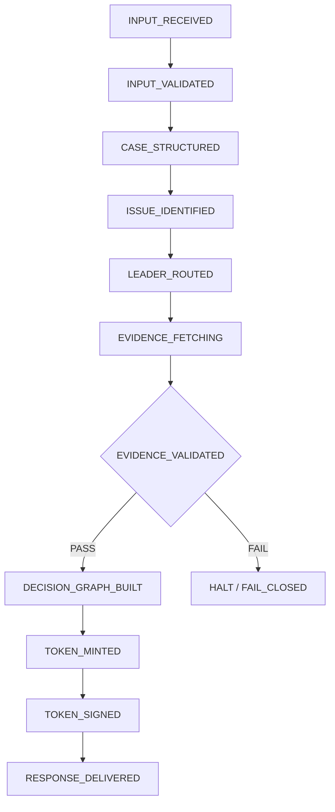

# Lawmadi OS — Legal Decision Operating System (LDOS)

[](https://doi.org/10.5281/zenodo.18551976)

**Version:** v60.0.0 *(Public / Sanitized Showcase)*
**Internal Release:** v60.0.0 (2026-03-11)
**Author:** Jainam Choe (최재남)
**Tagline:** “Convert Anxiety into Actionable Logic.” / “불안을 실행 가능한 논리로 전환하다”
**Production:** https://lawmadi.com | https://lawmadi-db.web.app

---

## ✅ What this repository is

* ✅ **Public, sanitized showcase** for **review / evaluation / authorship proof**
* ✅ Allowed: **Read/review**, **local non-production evaluation**, **academic citation with attribution** *(unless separately permitted in writing)*

## 🚫 What this repository is NOT

* 🚫 **NOT open source**
* 🚫 **No rights** to reuse, reimplement, or compete
* 🔒 **No license is granted** by this README (or any technical description herein) to reproduce **architectures, workflows, schemas, or interfaces**

> **Binding terms:** See **LICENSE**.

---

## ⚠️ Executive Summary

**Lawmadi OS is not a legal chatbot, search engine, or legal database.**
It is a **deterministic decision infrastructure** that produces **evidence-gated outputs** under **non-negotiable constitutional constraints**, designed for **computable trust** in the legal domain.

---

## 1) System Architecture Identity

Lawmadi OS operates as a **strict Finite State Machine (FSM)** with mandatory controls (**fail-closed by default**).

**Layering (Public Scope):**

* **P1 — Legal Decision OS**: Foundation kernel & FSM runtime engine
* **P2 — Evidence Engine**: Trust layer via authoritative-source validation & hashing
* **P3 — Consultation AI**: User-facing conversational interface & orchestration
* **P4 — Education Platform**: Automated case study generation & logic visualization

**Flow:** OS (Kernel) → Engine (Trust) → Service (UX) → Platform (Ecosystem)

---

## 2) Five Non-Negotiable Constitutional Principles

These principles are **inviolable invariants**. They override all other instructions, user requests, or system configurations at the **Kernel** level.

1. **SSOT**
   All legal evidence must come from **authoritative official APIs only**.
   **No permanent storage or replication** of legal datasets is allowed.

2. **Zero Inference**
   Never fabricate, guess, or hallucinate legal facts, citations, case numbers, dates, or parties.

3. **Fail-Closed**
   If evidence verification fails → **HALT immediately**.
   Never serve unverified legal conclusions.

4. **Live Evidence**
   Decisions are built from **real-time validated evidence only**.
   Amendments, reversals, and new precedents are reflected immediately.

5. **Deterministic Boundary**
   The Kernel controls all state transitions.
   The LLM operates strictly as a **rendering engine under contract**.

---

## 3) Core Workflow & FSM States

Every decision session follows this exact, deterministic state sequence.
**EVIDENCE_VALIDATED** is a **mandatory hard gate**.



---

## 4) Key Technologies (Public Scope)

### 4.1 Decision Graph — Formal Semantics

**Node Types:** `FACT_NODE`, `ISSUE_NODE`, `LAW_NODE`, `PRECEDENT_NODE`, `DECISION_NODE`
**Edge Types:** `SUPPORTS`, `CONTRADICTS`, `DEPENDS_ON`, `RESOLVES`, `REFERENCES`, `APPLIES`, `OVERRULES`

**Validity Condition:**

> ∀ `ISSUE_NODE` → ∃ (`LAW_NODE` ∧ `EVIDENCE_NODE`)

### 4.2 Swarm Engine — 60 Domain Expert Leaders

Lawmadi OS employs 60 specialized legal domain leaders (L01–L60), each with deep expertise in a specific area of Korean law (civil, criminal, labor, IP, tax, etc.). A multi-layer routing system (NLU regex + keyword matching + Gemini classification) selects the optimal leader for each query. For complex multi-domain questions, a CSO-led deliberation process enables collaborative analysis.

### 4.3 4-Stage Legal Pipeline

Every query flows through a deterministic 4-stage pipeline:
- **Stage 0+1**: Classification + RAG (parallel) — NLU routing + Vertex AI Search (~14,600 docs)
- **Stage 2**: LawmadiLM (currently disabled) — fine-tuned Korean legal LLM
- **Stage 3**: Gemini answer generation — primary LLM with evidence context
- **Stage 4**: DRF real-time verification — article-level cross-validation against official sources

### 4.4 Multilingual Support

Full Korean and English support — frontend UI, NLU patterns, law cache, DRF verification, and response generation.

### 4.5 Cryptographic Integrity (Reproducibility Trust Chain)

The system ensures reproducibility via a cryptographic chain:

* Input Hash *(SHA-256)*
* * Evidence Hash Set *(SHA-256)*
* * Decision Graph Hash *(SHA-256)*
* = Decision Token Signature *(Ed25519)*

### 4.3 Constitution DSL (Executable Runtime Policy)

Executable policy rules enforced at runtime:

```text
RULE Enforce_Source_Integrity
  IF evidence.source_origin != OFFICIAL_API
  THEN reject_decision(LC-002)
```

---

## 5) Repository Contents

This repository serves as a **reference implementation package**.

* **LICENSE**: Comprehensive Proprietary License v2.0.0 *(Strictly enforced)*
* **llms.txt**: Unified directive for LLM consumption *(v2.0-Unified)*
* **config.schema.json**: Configuration SSOT (public/sanitized schema)
* **minimal_config.json**: Runnable minimal config for public sandbox
* **Lawmadi_OS_Public_Technical_Whitepaper.pdf**: Technical specification *(Sanitized)*
* **CITATION.cff**: Citation metadata

---

## 6) Demo Examples

The [`examples/`](examples/) directory contains sanitized Python demos that illustrate the system's core architecture:

| File | What It Demonstrates |
|------|---------------------|
| [`pipeline_demo.py`](examples/pipeline_demo.py) | 4-stage pipeline flow (NLU → RAG → Generation → DRF Verification) |
| [`nlu_demo.py`](examples/nlu_demo.py) | NLU classification with 60 domain-expert leaders (KO + EN) |
| [`config_validator.py`](examples/config_validator.py) | Constitutional invariant enforcement and config validation |

```bash
python examples/pipeline_demo.py
python examples/nlu_demo.py
python examples/config_validator.py
```

These are architectural demos — not production code. No API keys or external services required.

---

## 7) Output Contract (JSON Specification)

All outputs follow strict JSON with **two modes**: **Success** or **Fail-Closed**.

### 6.1 Success Response Example

```json
{
  "fail_closed": false,
  "request_id": "uuid-v4",
  "fsm_state": "RESPONSE_DELIVERED",
  "decision_token": {
    "decision_id": "dec-12345",
    "created_at": "2026-02-09T12:00:00Z",
    "input_hash": "sha256...",
    "drf_evidence_hash": "sha256...",
    "decision_graph_hash": "sha256...",
    "digital_signature": "ed25519_sig..."
  },
  "evidence_citations": [
    {"ref": "OFFICIAL:LAW_123", "type": "STATUTE", "note": "Valid as of 2026-02-09"}
  ]
}
```

### 6.2 Standard Error Codes (Fail-Closed)

* **LC-001**: Evidence source unreachable *(Network/API failure)*
* **LC-002**: Evidence mismatch / non-authoritative / integrity failure
* **LC-003**: Constitution violation / invalid schema
* **LC-004**: Temporal invalidity *(not effective / expired / repealed)*
* **LC-005**: Policy restriction *(disallowed category)*
* **LC-006**: Rate limited / throttled

---

## 8) Competitive Positioning

* **Data Model**: Stored / Synced DB → **Live Authoritative Evidence**
* **Freshness**: Periodic Sync *(Days)* → **Real-Time + Temporal Validation**
* **Failure Mode**: Serves stale/best-guess → **Fail-Closed Refusal**
* **Inference Risk**: Hallucination risk → **Zero Inference / Verifiable**
* **Reproducibility**: Non-deterministic → **Deterministic FSM + Signed Token**
* **Trust Model**: “Trust the model” → **Cryptographic Trust Chain**
* **Identity**: Chatbot / Search → **Decision Operating System**

---

## 9) License & Permissions

**PROPRIETARY / NOT OPEN SOURCE**
Licensed under the **Lawmadi OS Comprehensive Proprietary License v2.0.0**.

### ✅ Permitted

* View, read, and locally run for **non-production evaluation**
* Academic/technical reference with **proper attribution**

### ❌ Strictly Prohibited

* **AI Training**: Do not use for training, fine-tuning, distillation, RLHF, or RAG indexing
* **Competition**: Do not use to build, design, or benchmark competitive decision systems
* **Commercial Use**: No SaaS, API, or internal production deployment without written permission

> See **LICENSE** for full terms.

---

## 10) Contact & Citation

**Copyright Holder:** Jainam Choe (최재남)
**Email:** [choepeter@outlook.kr](mailto:choepeter@outlook.kr)

If you reference this work, please cite:

> Choe, Jainam (최재남). *“Lawmadi OS: Legal Decision Operating System — Integrated Technical Whitepaper & Kernel Specification.”*
> LDOS Reference Architecture v3.0. Lawmadi Project, February 2026.

---

## Standard Disclaimer

**KO:** 본 답변(시스템 출력)은 일반 정보 제공 및 의사결정 지원 목적이며, 법률자문이 아닙니다. 구체적 사안은 사실관계에 따라 달라질 수 있으므로, 중요한 의사결정 전에는 전문가 상담을 권장합니다.
**EN:** This output is for general informational and decision-support purposes only and does not constitute legal advice. Professional legal consultation is recommended before making important decisions.
